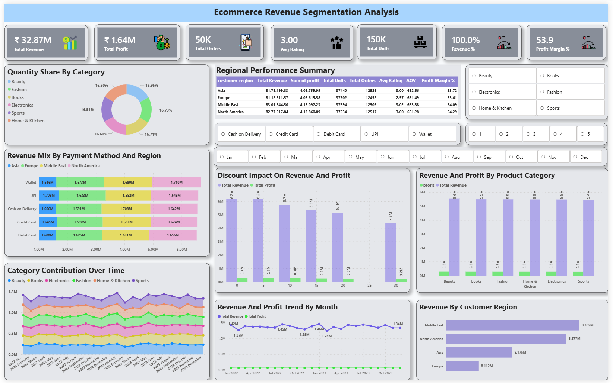

# 🛒 Ecommerce Revenue Segmentation Analysis

🚀 End-to-end Data Analytics & Business Intelligence project focused on analyzing ecommerce sales data to identify revenue drivers, customer segments, and business optimization opportunities.

---

## 🎯 Project Objective

* Analyze ecommerce transaction data
* Identify key revenue drivers
* Segment customers based on behavior
* Build insights for business decision-making
* Create dashboard-ready datasets

---

## 🛠 Tech Stack

* **SQL (PostgreSQL)** – Data cleaning, transformation & analysis
* **Python** – EDA & segmentation
* **Power BI** – Dashboard & visualization
* **Excel** – Data validation

---

## 📂 Project Structure

```
ecommerce_revenue_segmentation_analysis/

│── data/
│── sql/
│   ├── 01_data_cleaning.sql
│   ├── 02_kpi_analysis.sql
│   ├── 03_customer_segmentation.sql
│   └── 04_revenue_analysis.sql
│
│── dashboard/
│── insights/
│── recommendations/
│── README.md
```

---

## 🔍 Key Analysis Performed

### 1️⃣ Data Cleaning

* Handled missing values
* Standardized categorical data
* Created derived columns (revenue, profit)

---

### 2️⃣ KPI Analysis

* Total Revenue: ₹32.8M
* Total Orders: 50K
* Avg Order Value: ₹657
* Identified category, region, and payment trends

---

### 3️⃣ Customer Segmentation

* Revenue-based segmentation
* Frequency segmentation
* Profit segmentation
* RFM (Recency, Frequency, Monetary) analysis

---

### 4️⃣ Revenue Analysis

* Category-wise performance
* Region-wise comparison
* Monthly & daily trends
* Discount impact analysis
* Pareto (80/20 rule)

---

## 📊 Key Insights

* Shows **BEAUTY** as top revenue category
* Shows **MIDDLE EAST** as top region
* Shows **low discounts (0–5%) generate highest revenue**
* Shows **balanced revenue distribution across categories**
* Shows **no strong correlation between rating and revenue**
* Shows **seasonal trends in monthly sales**

---

## 🚀 Business Recommendations

* Focus on high-performing categories (BEAUTY)
* Improve slightly weaker regions (EUROPE)
* Optimize discount strategy (avoid high discounts)
* Leverage peak months for campaigns
* Promote digital payment methods

---

## 📊 Dashboard



Interactive dashboard built using Power BI to visualize:

- Revenue trends  
- Customer segmentation  
- Category & region performance  
- KPI tracking  

---

## 🧠 Business Impact

* Improved understanding of revenue drivers
* Identified high-value customer segments
* Enabled data-driven decision making
* Highlighted optimization opportunities

---

## 📌 Conclusion

This project demonstrates an end-to-end workflow from raw data to actionable business insights using SQL, Python, and BI tools.

---

## ⭐ If you like this project

Give it a ⭐ on GitHub and connect with me!

---
