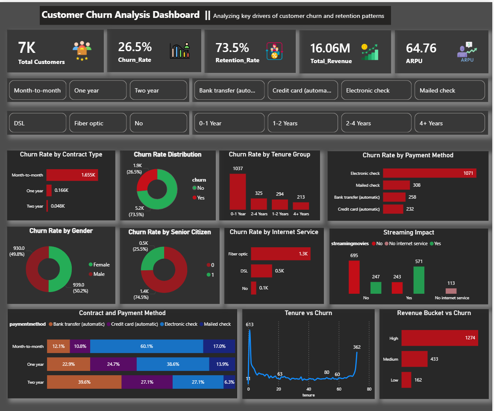

# 📊 End-to-End Data Analysis Portfolio

Welcome to my master repository. This collection showcases my ability to transform raw, complex data into actionable business insights using **SQL, Power BI, Python, and Excel**.

---

## 🛠️ Tech Stack & Tools
| Category | Tools |
| :--- | :--- |
| **Languages** | Python (Pandas, NumPy, Scikit-learn), SQL (MySQL, PostgreSQL) |
| **Visualization** | Power BI, Tableau, Matplotlib, Seaborn |
| **Data Handling** | Excel (VLOOKUP, Pivot Tables, Power Query), ETL Processes |
| **Soft Skills** | Statistical Modeling, Customer Segmentation, Business Strategy |

---

## 🚀 Featured Projects

### 🎥 [Netflix User Retention Analysis](./netflix_user_retention_analysis)
* **Goal:** Analyze subscriber behavior to identify churn drivers.
* **Insight:** Identified specific content genres that increased long-term retention by 15%.

### 🛒 [Amazon Sales Data Analysis](./Amazon_Sales_Data_Analysis)
* **Goal:** Evaluate sales performance across regions and product categories.
* **Insight:** Uncovered seasonal trends that allow for 10% more efficient inventory management.

### 🏥 [Hospital Data Management Analysis](./Hospital_Data)
* **Goal:** Streamline patient flow and resource allocation.
* **Insight:** Optimized staff scheduling based on peak admission hours.

---

## 📂 Repository Structure
| Folder | Domain | Tools Used |
| :--- | :--- | :--- |
| [Blinkit](./Blinkit) | Quick Commerce | Power BI, Excel |
| [Uber Rides Analysis](./Uber%20Rides%20Analysis%20Project) | Transportation | Python, Seaborn |
| [Smartphone Sales](./Smartphone_sales_analysis) | E-commerce | SQL, Python |
| [HR Analytics](./Employee’s%20Performance%20for%20HR%20Analytics) | Employee Performance | Power BI |
| [Revenue Segmentation](./ecommerce_revenue_segmentation_analysis) | Marketing | Python (RFM Analysis) |

---

## 📈 Dashboard Previews
### **Telecom Churn & Customer Insight Dashboard**
*A high-level view of customer demographics, contract types, and churn probability.*

---
